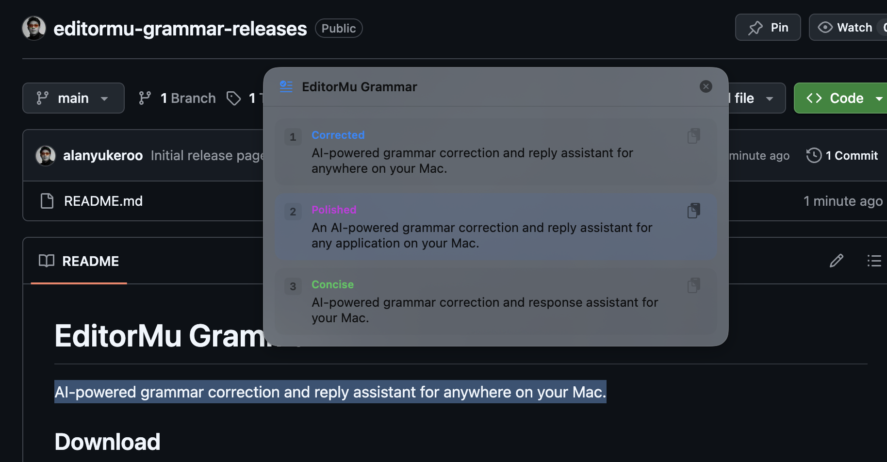
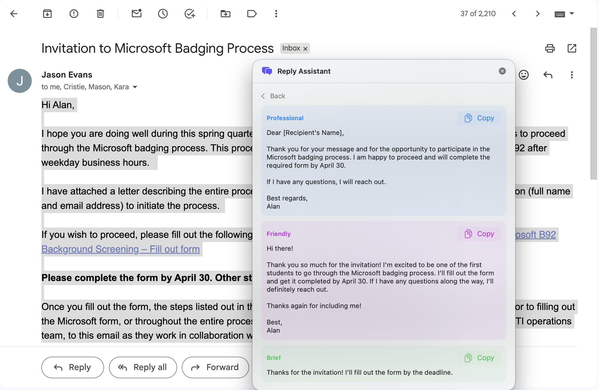
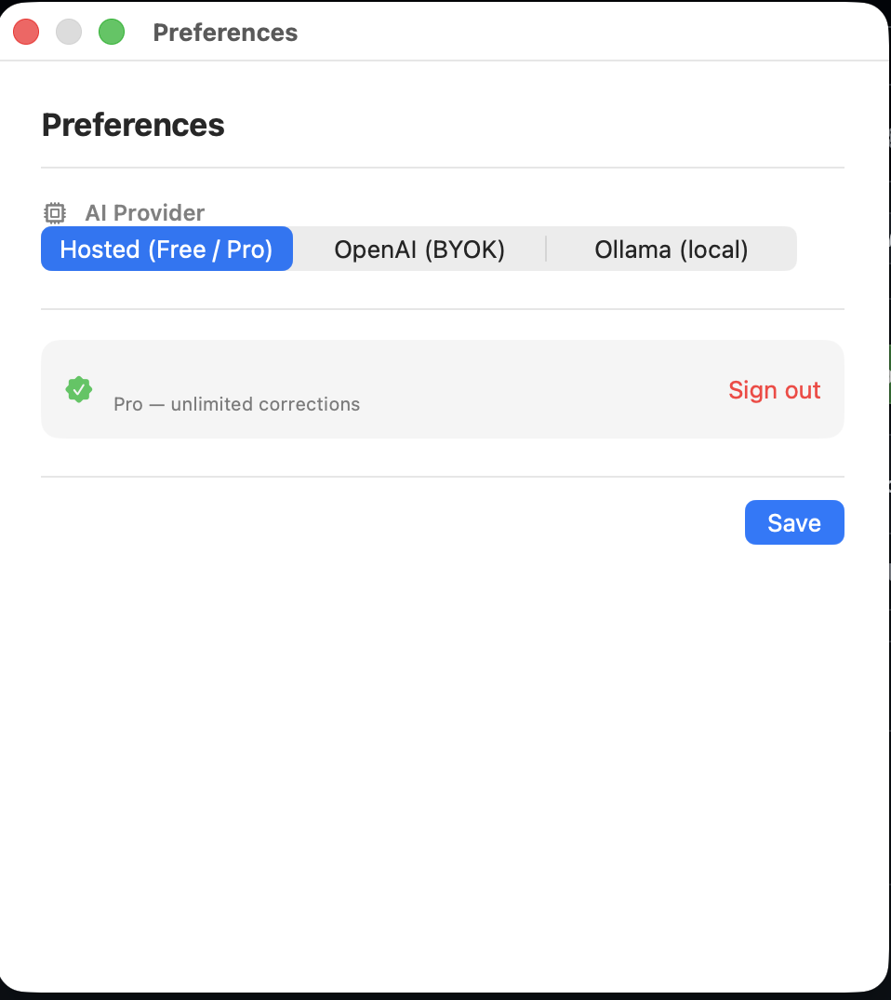
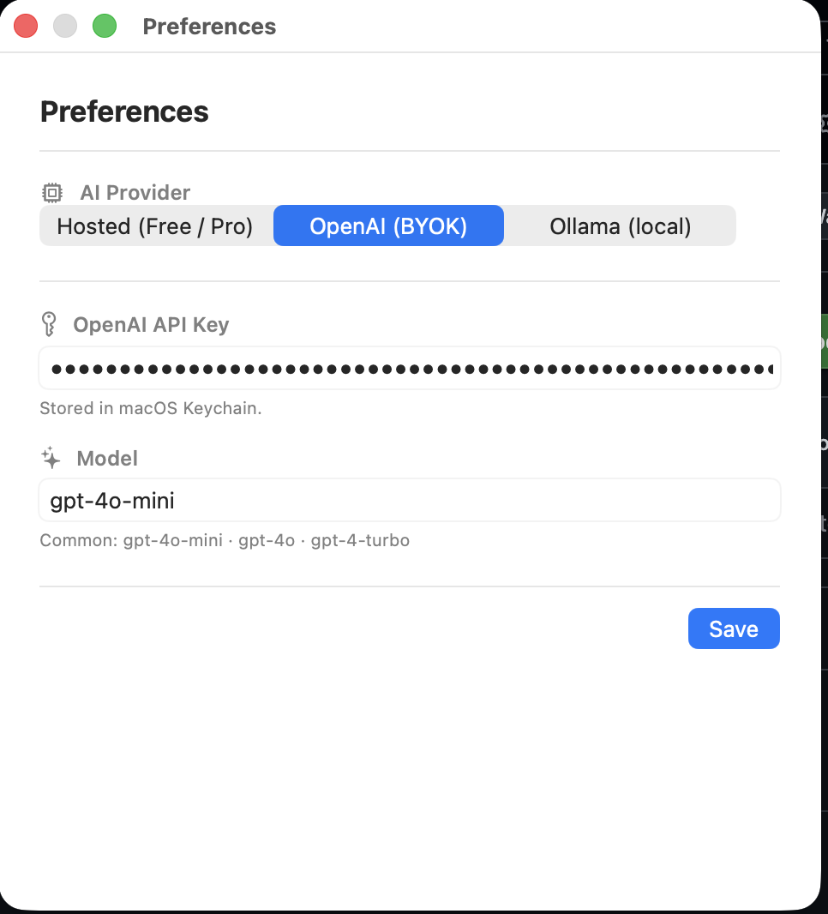
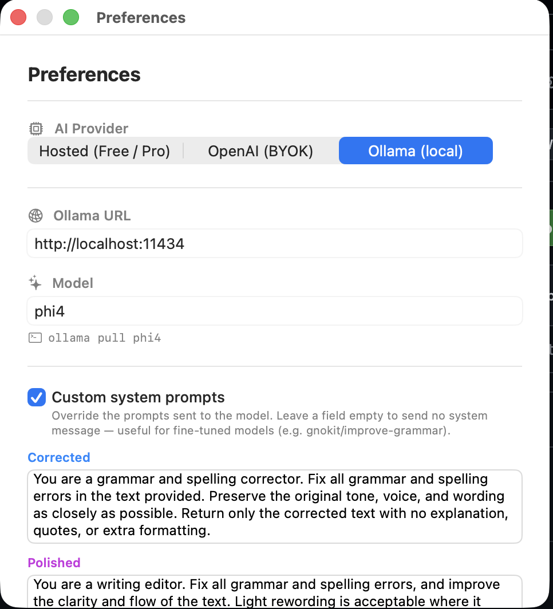

# EditorMu Grammar

AI-powered grammar correction and reply assistant for anywhere on your Mac.

## Download

👉 **[Download Latest Release](https://github.com/alanyukeroo/editormu-grammar-releases/releases/latest)**

## Screenshots

### Fix grammar anywhere — ⇧⌘G

### AI reply suggestions — ⌥⌘R

### Hosted free tier (sign in with Google)

### Bring your own OpenAI key

### Or run fully local with Ollama

## Install

1. Download `EditorMuGrammar.dmg` from the link above
2. Open it → drag EditorMuGrammar to Applications
3. Right-click the app → **Open** (first time only, to bypass Gatekeeper)
4. Grant Accessibility permission when prompted
5. Look for the ✓ icon in your menu bar

## Shortcuts

| Shortcut | Action |
|---|---|
| ⇧⌘G | Fix grammar in any selected text |
| ⌥⌘R | Generate AI reply for any highlighted message |

## Pricing

| Plan | Price | Corrections |
|---|---|---|
| Free | $0 | 30/month |
| Pro | $5/month via Ko-fi | Unlimited |
| Self-hosted | Free | Unlimited (your API key) |
